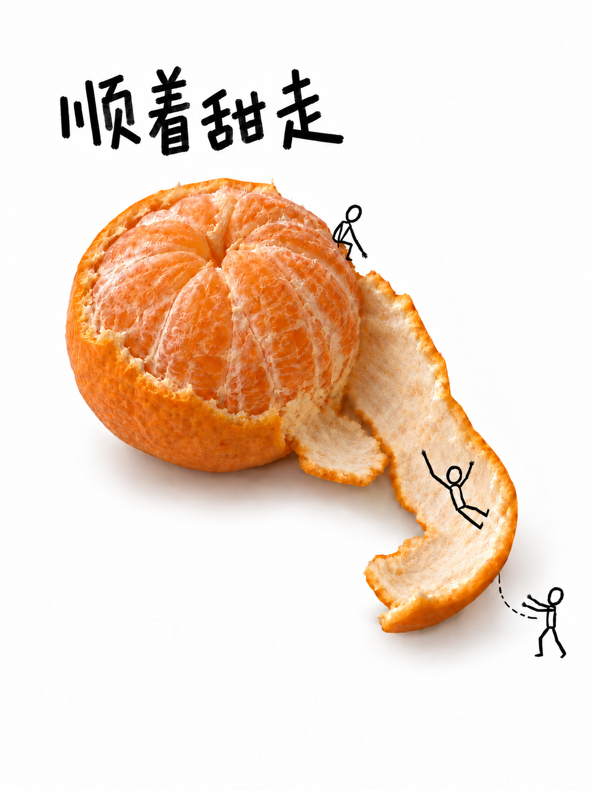
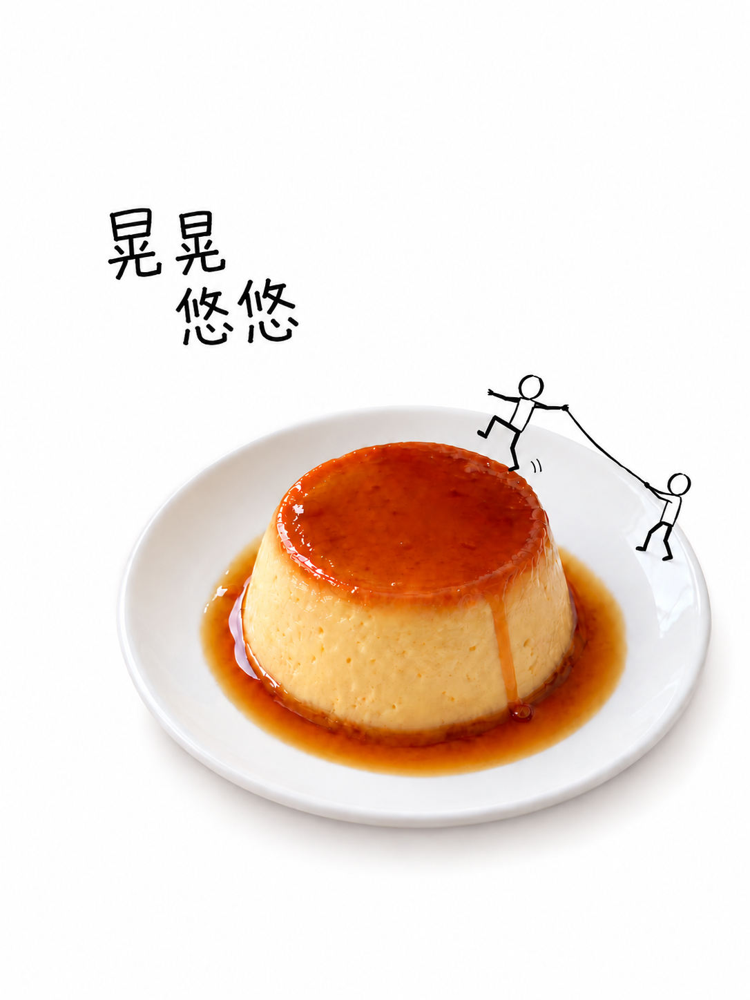
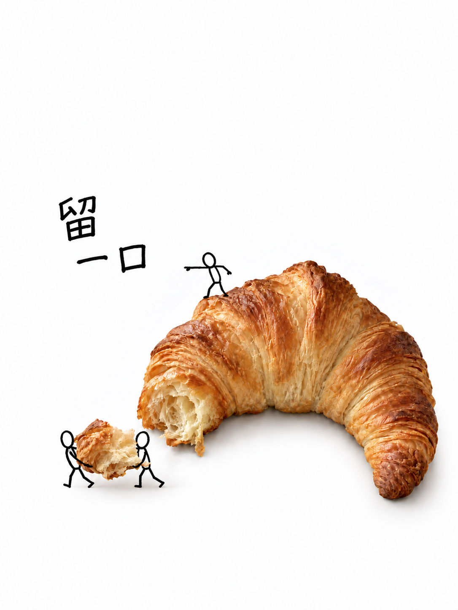
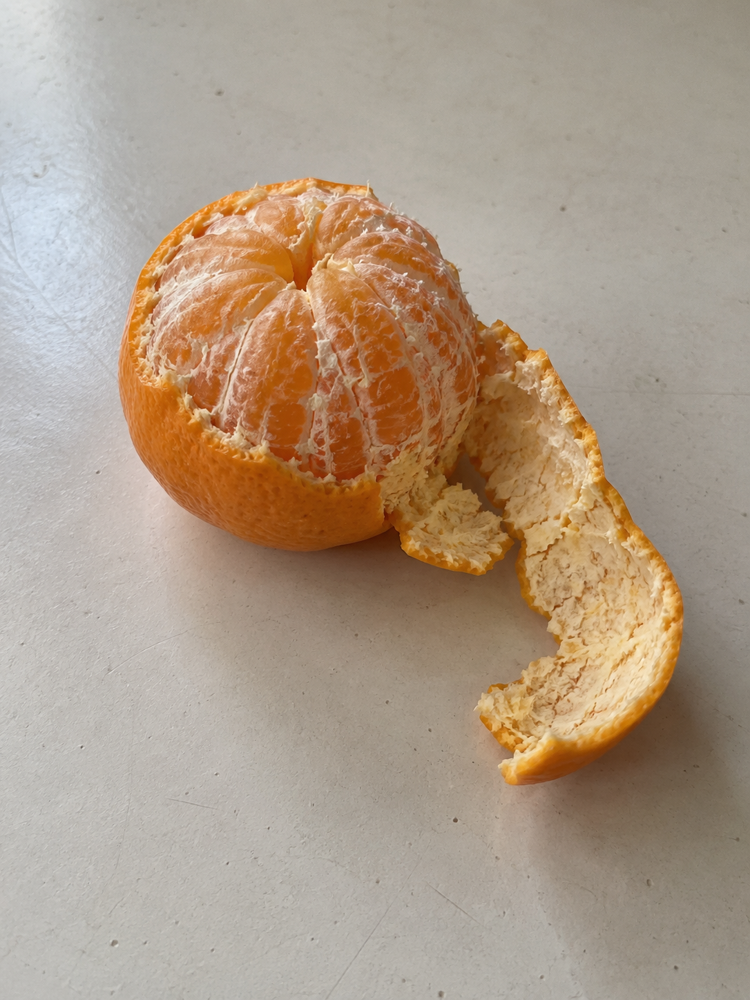
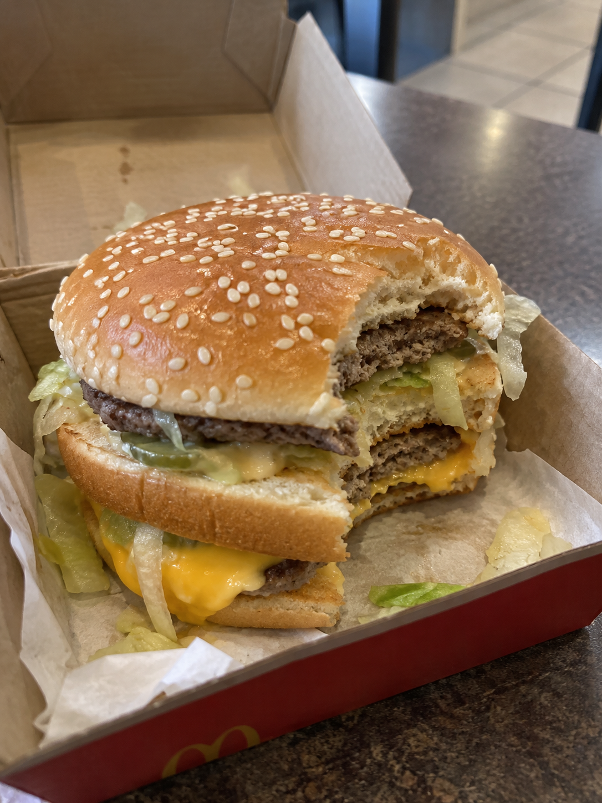
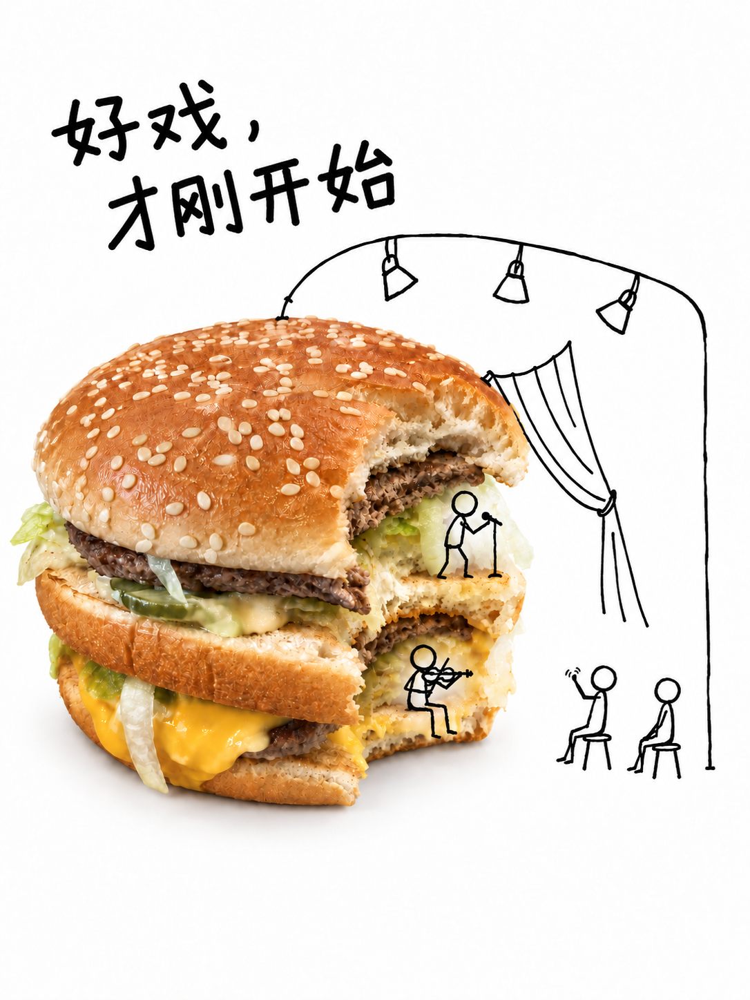
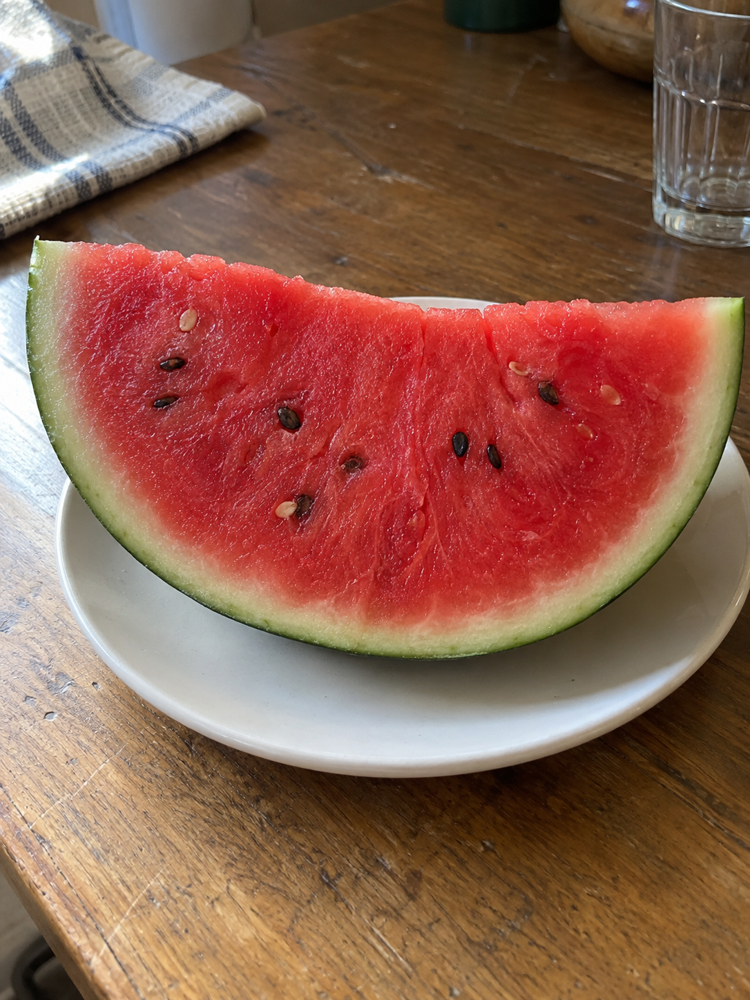
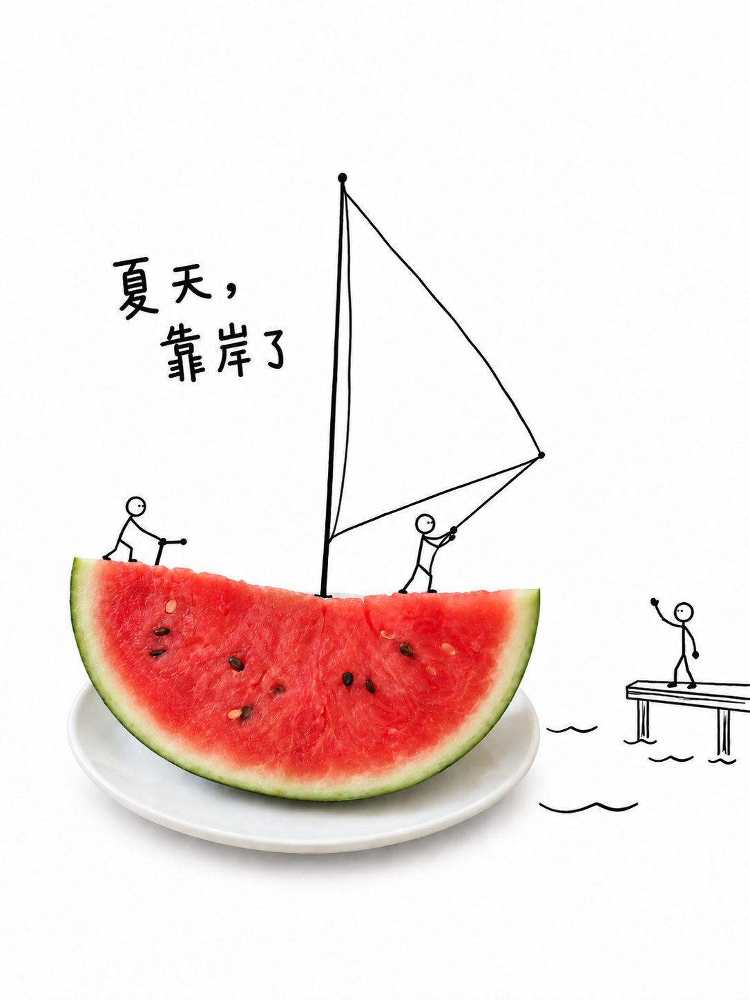
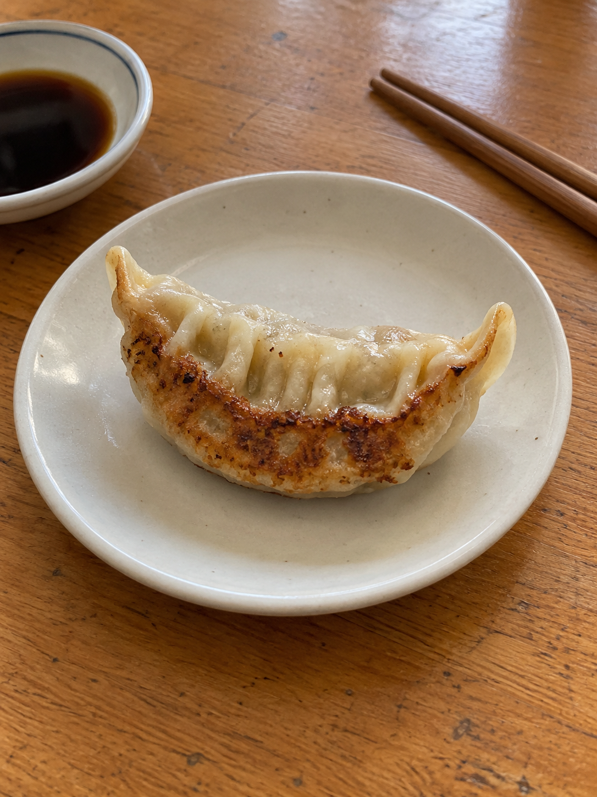
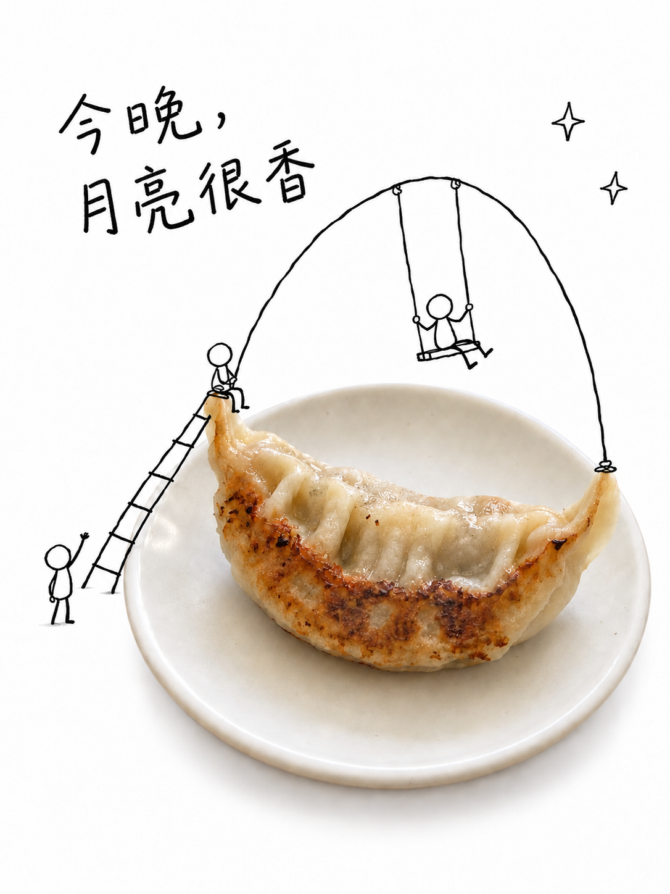

# 喜茶风格创意海报 Skill｜麻酱·照片小人剧场

**上传一张照片，让真实物件和黑线小人演一出小小的戏。**

一个喜茶风格的照片转海报 Agent Skill：保留食物与物件的真实质感，用纯白留白、稚拙黑线小人和朴拙中文手写，把日常照片变成有故事的创意海报。

小人借着物体的形状展开行动，线条跨过主体轮廓延伸进白处，再配一句属于这张图的短文案。适合食物、甜品、水果与生活物件的照片加小人、手绘涂鸦海报和微缩叙事创作。

**纯白留底 · 真实主体 · 2–6 位黑线小人 · 跨出轮廓的小故事 · 朴拙中文手写**

[看例图](#例图) · [安装与使用](#安装与使用) · [制作流程](#制作流程) · [许可与图像说明](#许可与图像说明)

> 非官方原创项目。“喜茶风格 / HEYTEA-inspired”用于描述视觉灵感；本项目与喜茶 / HEYTEA 无隶属、授权、赞助或合作关系，不提供品牌 Logo、官方广告或其他品牌资产。

## 例图

### 三张精选：橘子、布丁、牛角包

| 剥开的橘子 ·「顺着甜走」 | 焦糖布丁 ·「晃晃悠悠」 | 牛角包 ·「留一口」 |
| --- | --- | --- |
| [](examples/orange-poster.png) | [](examples/pudding-poster.png) | [](examples/croissant-poster.png) |
| 长橘皮变成滑梯，顺着弧线把快乐送到白处。 | 借布丁轻轻晃动的想象，演一幕互相拉住的平衡游戏。 | 从酥皮缺口展开小小的分享，让一口面包也有分量。 |

这三张是项目创作迭代中的精选成图，点击图片可查看大图。

### 从输入到海报

以下四组的输入素材与成图均由 AI 生成。输入图用于模拟照片编辑流程，不是实拍照片。布丁与牛角包在上方展示成品。

#### 橘皮滑梯

“顺着甜走”

| 输入素材 | 小人剧场 |
| --- | --- |
| [](examples/orange-source.png) | [](examples/orange-poster.png) |

提示方向：沿着半剥橘子的长弯橘皮安排滑行与接应，让小人的行动从果肉一直延伸到外部留白。这里展示的是主体修整后的成图。

#### 汉堡剧场

“好戏，才刚开始”

| 输入素材 | 小人剧场 |
| --- | --- |
| [](examples/burger-source.png) | [](examples/burger-poster.png) |

提示方向：借汉堡的咬口搭起小舞台，让灯架和观众延伸到外部留白；保留食物本来的层次与缺口。

#### 西瓜小船

“夏天，靠岸了”

| 输入素材 | 小人剧场 |
| --- | --- |
| [](examples/watermelon-source.png) | [](examples/watermelon-poster.png) |

提示方向：借西瓜的弯形想象一艘小船，让风帆、人物和码头跨过主体轮廓，把抵达的心情放进夏天。

#### 煎饺月亮

“今晚，月亮很香”

| 输入素材 | 小人剧场 |
| --- | --- |
| [](examples/dumpling-source.png) | [](examples/dumpling-poster.png) |

提示方向：从煎饺的弯月轮廓长出秋千与小人的活动空间，让梯子延展进白处；画面保持白底，不另造夜景背景。

这些是具体作品，不是每张照片都要套用的模板。换一件物体，就重新找它自己的故事。

## 为什么用这份 Skill

- **先看主体，再做修整。** 清理背景与明显干扰，适度平衡曝光；保留原形、材质、视角、缺口与有辨识度的细节。
- **从物体长出场景。** 先找到真实特征，再推导场景意象与人物经历。黑线结构要有作用，并跨越主体轮廓进入留白。
- **让小人少而有戏。** 默认 2–6 位，空心歪圆头、几笔身体、折角手脚。全黑、稀疏、笨拙，动作要读得懂。
- **让短句属于这张图。** 文案呼应主体与人物的经历，避免换张照片也能用的泛用口号。
- **把字形单独做好。** 先完成无字底图，再处理朴拙中文手写。文字内容准确、字形自然，是两项独立检查。

适合照片加小人、食物与涂鸦混合、微缩叙事海报，也适合已有作品的主体或中文字定向修正。普通照片修复、与照片无关的插画不属于主要用途。

## 安装与使用

这是一个 **Agent Skill**：包含制作规范、提示词与验收清单。它需要当前 AI 环境能看图，并具备基于参考图片进行编辑的能力；安装本技能不会自动提供图像模型、API 密钥或在线出图服务。

### 在 Codex 中安装

如果当前 Codex 环境提供 `skill-installer`，可将下面这段话发给它：

> 请使用 skill-installer 安装 https://github.com/SilviaZhong/majiang-photo-story 。Skill 位于仓库根目录，安装名称为 majiang-photo-story。

安装成功后，在新一轮对话中上传图片，并点名使用 `$majiang-photo-story`。

其他支持 `SKILL.md` 的应用，可下载本仓库 ZIP，保持完整目录结构，按该应用的官方说明安装。不同应用的技能入口与图像能力各不相同；没有技能安装功能时，也可以阅读并使用本仓库的制作方法和提示词。

### 第一次试作

上传一张你有权使用的图片，再发送：

> 用 $majiang-photo-story 把这张照片做成喜茶风格创意海报：纯白底的小人剧场。先克制修整主体，保留它的真实形状、材质和缺口。设计一幕从主体长到外部留白的故事，默认 2–6 位稀疏黑线小人。先做无字底图，再加一句贴合画面的朴拙中文手写标题。

需要时补充画幅、精确人数、指定标题或无字要求。不指定时默认采用 3:4 竖幅，并根据主体调整，不裁切主体凑比例。

### 只想改某一处

> 只修这张已完成作品里的主体，改善过度锐化造成的干硬感。以原图为保真依据，保留构图、小人数与动作、白底、标题原文和字形；不要重新设计整张图。

> 标题只保留“今晚，月亮很香”。先检查每个字是否完整准确，再把字形改得朴拙一些：钝笔、骨架微歪、间距不齐，不用毛笔书法或规整印刷字体。

仅讨论方案或修改 Skill 时，不会自动开始出图。批量制作先做一张代表性试作，再决定是否继续。

## 制作流程

1. **看原图。** 记录主体的形状、数量、材质、颜色、视角和关键标识，分清保留项与可修问题。
2. **修主体。** 必要时先适度清理与调整，对照原图验收，不重塑食物。
3. **搭故事。** 按“真实特征 → 场景意象 → 人物经历”构思同一幕，让黑线场景从主体延伸到白处。
4. **验底图。** 先完成纯白背景、照片主体与小人故事，不添加标题，检查人数、接触关系和留白。
5. **做标题。** 锁定唯一文案，再处理原创手写字；工具支持时用独立图层，否则分阶段编辑标题区。
6. **看整图。** 对照原图复查主体，逐字检查标题，再独立检查字形风格。局部编辑后也要重新看全图。

默认初稿后最多做两轮针对性修正；仍有关键缺陷时如实说明。图像工具不一定能保留完全相同的区域外像素，也不保证首次中文字正确。

## 文件结构

```text
majiang-photo-story/
├── SKILL.md                       # 触发条件、视觉基线、完整工作流与验收清单
├── agents/
│   └── openai.yaml                # 可选的 Codex 展示信息
├── references/
│   ├── story-composition.md       # 叙事推导、人物关系、外延与构图
│   └── lettering-prompts.md       # 中文手写规则与分阶段提示词
├── examples/                      # 六个创作案例；四组输入/成图与两张精选成品
├── README.md
└── LICENSE
```

先读 [SKILL.md](SKILL.md)。构思场景时读 [叙事与构图](references/story-composition.md)；制作或修中文字时读 [中文手写字与提示词](references/lettering-prompts.md)。两份参考文件包含可按照片填实的提示词骨架，不要把占位符直接发送给图像工具。

## 风格参考与致谢

方法研究参考了以下开源项目，对照片主体、白底、黑线涂鸦与手写字之间的关系有很大启发：

- [shouna12358-png/heytea-creative-style](https://github.com/shouna12358-png/heytea-creative-style)
- [Hchen1218/heytea-style](https://github.com/Hchen1218/heytea-style)
- [iamxk116-ai/heytea-style-skill](https://github.com/iamxk116-ai/heytea-style-skill)
- [yinxiaowai/heytea-doodle-poster](https://github.com/yinxiaowai/heytea-doodle-poster)

本仓库重新整理了规则、提示词与验收流程，没有打包这些项目的图片、字体或代码。具体方法说明见 [方法出处与边界](references/story-composition.md#方法出处与边界)。

## 许可与图像说明

本仓库的原创说明、提示词与示例文件以 [MIT License](LICENSE) 开放，版权声明为 © 2026 SilviaZhong。使用、修改或分发时请保留许可证要求的声明。

示例的输入素材与成图均为 AI 生成，AI 输出的著作权状态可能因司法辖区而异。示例中可能出现的商标及其他第三方权利不在授权范围内，本项目与相关品牌没有关联，也不代表品牌认可。使用你自己的图片时，请确认具备相应使用权限。
